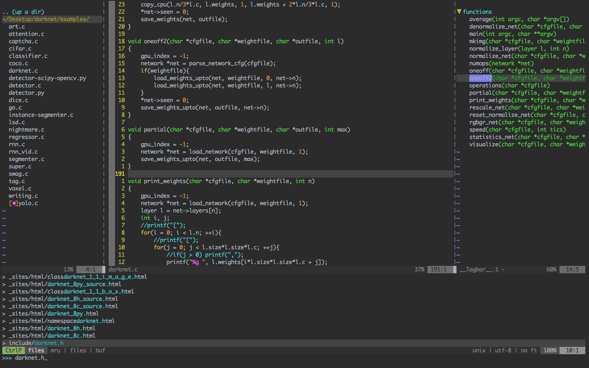
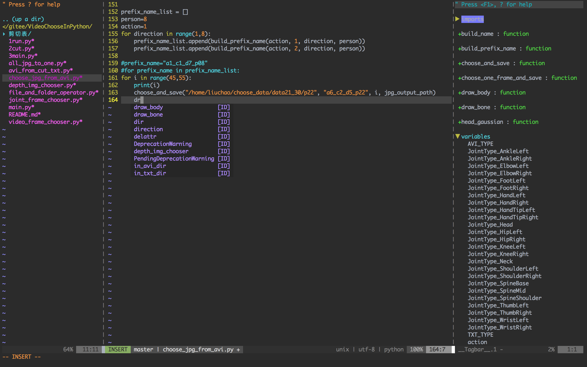

# vimrc
This is a vimrc project.  [settings.vim](settings.vim) is for vim and plugins configs. Files  [cfgs/*_cfg](cfgs) are used for config for corresponding plugin.





## My plugins

plugins I am using...

| Type   | Vundle                                   | cfgs                                     |
| ------ | ---------------------------------------- | ---------------------------------------- |
| THEMES |                                          |                                          |
|        | Plugin 'itchyny/lightline.vim'           | [cfg](cfgs/lightline_cfg.vim)            |
|        | Plugin 'scrooloose/nerdtree'             | [cfg](cfgs/nerdtree_cfg.vim)             |
|        | Plugin 'Xuyuanp/nerdtree-git-plugin'     |                                          |
|        | Plugin 'majutsushi/tagbar'               | [cfg](cfgs/tagbar_cfg.vim)               |
|        | Plugin 'tpope/vim-fugitive'              | [cfg](cfgs/fugitive_cfg.vim)             |
|        | Plugin 'Plugin 'kien/ctrlp.vim'          | [cfg](cfgs/ctrlp_cfg.vim)                |
| CODES  |                                          |                                          |
|        | Plugin 'Valloric/YouCompleteMe'          | [cfg](cfgs/ycm_cfg.vim)                  |
|        | Plugin 'SirVer/ultisnips'                |                                          |
|        | Plugin 'honza/vim-snippets'              |                                          |
|        |                                          |                                          |
|        | Plugin 'Yggdroot/indentLine'             |                                          |
|        | Plugin 'tell-k/vim-autopep8'             | [cfg](cfgs/autopep8_cfg.vim)             |
|        | Plugin 'jiangmiao/auto-pairs'            |                                          |
|        | Plugin 'terryma/vim-multiple-cursors'    | [cfg](cfgs/vim-multiple-cursors_cfg.vim) |
| RUNS   |                                          |                                          |
|        | Plugin 'skywind3000/asyncrun.vim'        | [cfg](cfgs/asyncrun_cfg.vim)             |
| HELPS  |                                          |                                          |
|        | Plugin 'yianwillis/vimcdoc'              |                                          |
|        | Plugin 'vim-utils/vim-man'               |                                          |
| DOCS   |                                          |                                          |
|        | Plugin 'iamcco/mathjax-support-for-mkdp' | [cfg](cfgs/markdown_cfg.vim)             |
|        | Plugin 'iamcco/markdown-preview.vim'     |                                          |
|        | Plugin 'dhruvasagar/vim-table-mode'      |                                          |
|        |                                          |                                          |
|        |                                          |                                          |
|        |                                          |                                          |
|        |                                          |                                          |
|        |                                          |                                          |


## Install 

- Use scripts

  ```
  curl https://raw.githubusercontent.com/talengu/vim/master/install.sh
  ```


- Step by step

## Key-maps

| key         | thing                                                        |
| ----------- | ------------------------------------------------------------ |
| `<leader>s` | open the [settings.vim](settings.vim) in Vim and you can set key maps, add plugins. |
| `<leader>n` | open the NERDTree on the left                                |
| `<leader>t` | open the NERDTree tagbar on the right                        |
| `<leader>b` | call the YcmCompleter GoToDeclaration funtion                |
| `<leader>w` | jump between windows in a circle                             |
|             |                                                              |


## Theme
[talen_desert.vim](colors/talen_desert.vim) is a color theme based on desert.

my workspace like this...




thank you!

[1]: https://github.com/wklken/k-vim	"k-vim ycm tagbar 安装的参考"
[2]: https://github.com/amix/vimrc	"stars most in github"
[3]: https://github.com/humiaozuzu/dot-vimrc	"pictures good"

